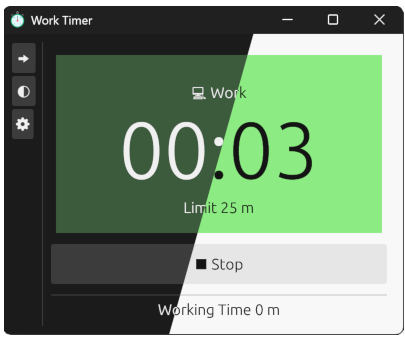

# Work Timer

A work timer powered by [egui](https://github.com/emilk/egui).

## Features
- The timer doesn't stop when the time exceeds the limit. Instead, it indicates with a color change when it times out.
    - This way you can know how much time you have exceeded.
- You can config multiple timers.
    - Each timer can be set to count up or down individually.
    - Only one timer will be used at a time.
- It will count the total working time.
- It supports both dark and light themes.

